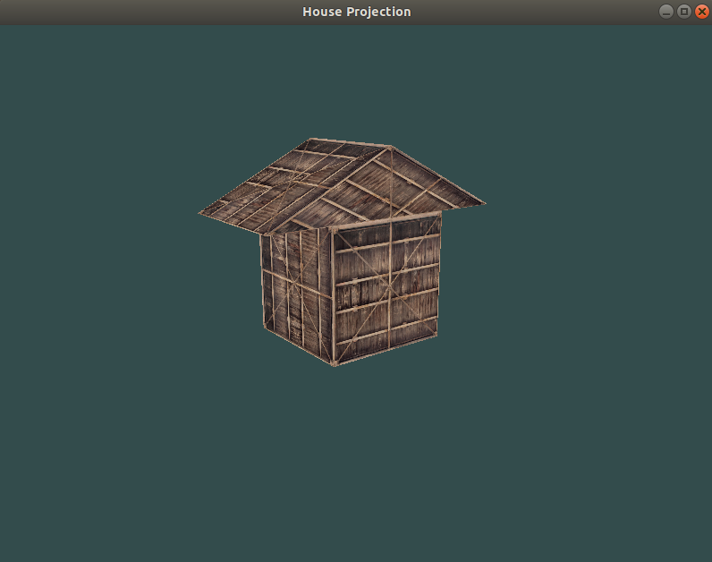

# Atividade de projeção em OpenGL
- **Aluno**: John Victor Farias de Omena
- **Professor**: Marcelo Costa Oliveira

## Funcionalidades

- [x] Casa 3D
- [x] Aplicação de textura
- [x] Camera
- [x] Visão em perspectiva

## Bibliotecas utilizadas

- [x] glfw
- [x] glad
- [x] glm
- [x] stb

## Codigo de compilação e execução

- g++ main.cpp glad.c stb_image.c -o main -lglfw3 -lGL -lX11 -lpthread -lXrandr -lXi -ldl -I/path/to/glm/headers
- ./main

## Vídeo de demonstração

caso haja algum problema de compilação/execução, há um vídeo demonstrando o funcionamento do código na pasta video_demo.

